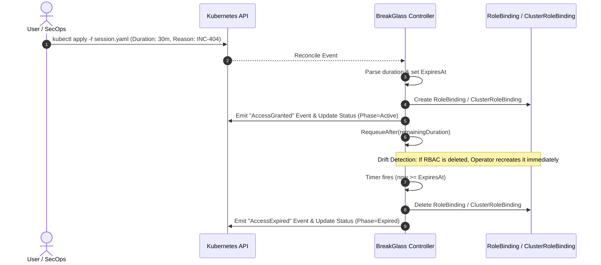

# BreakGlass Operator (JIT Kubernetes Access)

A lightweight, security-focused Kubernetes Operator that provides **Just-In-Time (JIT) / Break-Glass Privileged Access Management (PAM)**.

Instead of granting permanent `cluster-admin` or high-privilege `edit` rights to engineers or automation accounts, the BreakGlass Operator enables temporary, time-bound, and audited privilege escalation.



---

## Key Features & Learning Concepts

* **Time-Based Reconciliation (`RequeueAfter`)**: Uses the controller-runtime requeue mechanism without blocking worker threads.
* **Self-Healing & Drift Detection**: Watches both `RoleBinding` and `ClusterRoleBinding`. If an attacker or accident removes the binding while the session is active, it is recreated instantly.
* **Safe Cleanup via Finalizers**: Ensures cluster-scoped and namespaced RBAC objects are reliably purged when a session resource is deleted.
* **Auditability & Eventing**: Generates Kubernetes events (`AccessGranted`, `AccessExpired`, `AccessRevoked`) that can be ingested by SIEMs.
* **Early Revocation**: Set `spec.revoked: true` on an active session to terminate access prematurely.

---

## Quickstart

### 1. Run the Controller locally
Connects to your active `kubectl` context (e.g. `docker-desktop`):

```bash
# Install CRDs
make install

# Run controller locally
make run
```

### 2. Request a Break-Glass Session

```yaml
apiVersion: access.breakglass.io/v1alpha1
kind: BreakGlassSession
metadata:
  name: incident-db-emergency
spec:
  subject:
    kind: User
    name: "yannick.thomas@cloudogu.com"
  roleRef:
    kind: ClusterRole
    name: edit
  targetNamespace: "default"   # Omit for cluster-wide ClusterRoleBinding
  duration: "30m"              # Valid Go duration (e.g. 15m, 1h)
  reason: "Investigating broken database connection pool (INC-1092)"
```

Apply the sample:
```bash
kubectl apply -f config/samples/access_v1alpha1_breakglasssession.yaml
```

### 3. Check Session Status

```bash
kubectl get bgs
# NAME                    SUBJECT                       ROLE   TARGET-NS   PHASE    EXPIRES-AT             AGE
# incident-db-emergency   yannick.thomas@cloudogu.com   edit   default     Active   2026-09-25T10:45:00Z   10s
```

Check emitted Kubernetes events:
```bash
kubectl get events --field-selector involvedObject.kind=BreakGlassSession
```

### 4. Premature Revocation
To end access before the duration expires:

```bash
kubectl patch bgs incident-db-emergency --type='merge' -p '{"spec":{"revoked":true}}'
```

---

## Testing

Run unit & envtest integration tests:

```bash
make test
```
