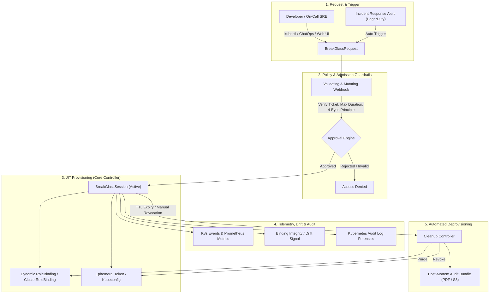

# 🔮 BreakGlass Operator – Zukunftsvision & Roadmap

> **Mission Statement**  
> Der **BreakGlass Operator** transformiert Kubernetes Access Management von einem statischen, überprivilegierten Modell (*„Entwickler haben permanente Admin-Rechte für Notfälle“*) in eine kompromisslose **Zero-Trust Just-In-Time (JIT) Privileged Access Management (PAM)** Plattform für Cloud-Native Workloads.

Die Produktgrenzen, Personas und die bewusst gestaffelte Weiterentwicklung
stehen in der [Produktvision](docs/product-vision.md). Der aktuelle
Security-Review mit den verbindlichen Release-Gates steht in
[docs/security-review.md](docs/security-review.md).

---

## 🏛️ Die Zukunftsvision: Vom Operator zur JIT-Plattform

In modernen Kubernetes-Umgebungen (SOC2, ISO 27001, PCI-DSS, FedRAMP) ist die permanente Vergabe von administrativen Rollen (`cluster-admin`, `edit`, `secrets`-Zugriff) ein kritisches Sicherheitsrisiko.

Der BreakGlass Operator schließt diese Lücke, indem er das **„Principle of Least Privilege“** automatisiert:
Standardmäßig besitzt niemand privilegierte Rechte. Bei Zwischenfällen wird der Zugriff temporär, begründet, freigegeben und lückenlos auditiert bereitgestellt – und nach Ablauf der TTL spurlos wieder entzogen.

> Das folgende Diagramm ist die **Zielarchitektur**, nicht der aktuelle
> Funktionsumfang: `BreakGlassRequest`, Approval Engine, kurzlebige Tokens und
> ein Post-Mortem-Export gehören zu späteren Phasen. Der heutige Kern erzeugt
> ausschließlich eine UID-überwachte, namespaced `RoleBinding`.



---

## 🗺️ Die 5-Phasen-Roadmap

> **Realitätscheck:** Die freie Auswahl von `subject`, `roleRef` und Scope ist
> durch AccessProfiles und Admission bereits entfernt. Das macht den aktuellen
> Slice zu einer belastbaren **namespaced** JIT-Basis, aber noch nicht zu einer
> produktionsreifen PAM-Lösung: Installations-/Ausfalltests, die Integrität der
> kuratierten ClusterRoles sowie Betrieb und Audit-Korrelation bleiben
> verbindliche Eintrittskriterien.

| Phase | Fokus | Hauptziel | Kerntechnologien |
| :--- | :--- | :--- | :--- |
| **Phase 1** *(Kern implementiert)* | **MVP & Core Reliability** | Solide CRD-Basis, `RequeueAfter`-Lifecycle, Fail-Closed Drift-Detection, Events | Kubebuilder, Controller-Runtime |
| **Phase 2** | **Security Boundary & Admission Governance** | Kontrollierte AccessProfiles, echte Requester-Identität, begrenzte RBAC-Delegation | Admission Webhooks, Cert-Manager, SubjectAccessReview |
| **Phase 3** | **Interactive Approvals & ChatOps** | 4-Augen-Prinzip, Slack/Teams Integration, Self-Service CLI | Slack API / Webhooks, CLI-Plugin |
| **Phase 4** | **Audit Trail & Forensik** | Was hat der User während der Session getan? Audit-Log Korrelation | K8s Audit Logs, OpenTelemetry |
| **Phase 5** | **Zero-Trust Identity Federation** | Kurzlebige Tokens statt statischer User, Cloud-IAM Bridging | OIDC, Ephemeral SAs, Vault |

---

### Phase 1: MVP & Core Reliability *(Kern implementiert)*
* [x] **CRD-Design**: `AccessProfile` und `BreakGlassSession` für genau eine namespaced `RoleBinding` pro JIT-Grant; clusterweite Grants sind bewusst nicht Teil von `v1alpha1`.
* [x] **TTL Controller**: Berechnet einen `RequeueAfter`-Zeitpunkt ohne Worker-Threads zu blockieren.
* [x] **Fail-Closed Binding-Watch**: Erkennt Änderungen an verwalteten Bindings und suspendiert statt automatisch neu zu gewähren.
* [x] **Audit Events**: Native K8s-Events (`AccessGranted`, `AccessExpired`, `AccessRevoked`).
* [x] **Finalizer-Pattern**: Sauberes Aufräumen aller K8s-Objekte bei Deletion.
* [x] **Grant-Härtung**: Unveränderliche Request-Daten, authentifizierte Human-Requester, Profil-UID-Snapshot und eindeutige Binding-Ownership über Binding-UID.

#### Noch vor produktivem Einsatz erforderlich
* [ ] **Threat Model & Support-Matrix**: Vertrauensgrenzen, zulässige Cluster-/Namespace-Modelle, Ausfallverhalten und unterstützte Kubernetes-Versionen festlegen.
* [ ] **Controller-Reliability-Tests**: Controller-Restart nahe der TTL, Namespace-/CR-Deletion-Rennen, Binding-Kollisionen und Uhrzeitgrenzen in envtest/Kind abdecken.
* [x] **Binding-Integrität & sichere Expiry**: `status.bindingRef` persistiert Kind, Namespace, Namen und Objekt-UID. Delete/Recreate, Subject-/Role-Drift, verlorene Ownership oder fehlende TTL führen fail-closed zu `Suspended`; es gibt kein automatisches Re-Granting. Cleanup nutzt eine UID-Precondition und löscht keinen Ersatz mit gleichem Namen. Expiry bleibt ein best-effort SLO, bis der Zugriff zusätzlich durch wirklich ablaufende Credentials begrenzt ist.
* [ ] **Scale-Grenzen**: RoleBinding-/AccessProfile-Watches mit Predicates und einem Feldindex auf `spec.accessProfile` begrenzen sowie Cache-/Reconcile-Last in großen Clustern messen.
* [ ] **Secure Supply Chain**: Nicht-root-Image, minimale RBAC-/NetworkPolicies, SBOM, Image-Signing und abhängigkeitsspezifische Security-Scans als Release-Gate etablieren.

---

### Phase 2: Admission Governance & Guardrails
> **Ziel:** Verhindern, dass Entwickler die CRD missbrauchen, um sich unbeaufsichtigt unbegrenzte Rechte zu verschaffen.

#### Aktueller `v1alpha1`-Stand
* [x] **Cluster-scoped `AccessProfile` für namespaced Grants**: Das Profil fixiert eine kuratierte `ClusterRole`, genau einen Ziel-Namespace und eine maximale Dauer. Es ist unveränderlich; ein Request kann weder Rolle noch Namespace wählen.
* [x] **Requester-Attribution & Profil-UID**: Der Mutating Webhook überschreibt den Empfänger aus dem authentifizierten API-User und snapshottet die serverseitige Profil-UID. ServiceAccounts sind im Self-Service-Slice absichtlich ausgeschlossen.
* [x] **Profil-`use`-Autorisierung**: Der Validating Webhook führt einen `SubjectAccessReview` für `use` auf dem konkret benannten Profil aus und prüft Profil-UID sowie maximale Dauer erneut.
* [x] **Datensparsame Betriebsmetriken**: Lifecycle, Binding-Drift, Cleanup-Lag, aktive/überfällige Sessions sowie Admission-Allow/Deny/Error sind mit festen Enum-Labels instrumentiert; Identitäten, Rollen, Namespaces, Tickets und Gründe erscheinen nicht als Labels.
* [~] **Produktions-Installations-Gate**: Das Production-Overlay liefert jetzt zwei Manager-Replikas, Leader Election, Host-Spreading und einen PDB; [Installations-, Upgrade- und Recovery-Schritte](docs/production-operations.md) sind dokumentiert. Offen bleiben ein reproduzierbarer Kind-Ausfalltest, die Supply-Chain-Gates sowie die clusterkonkrete, CA-validierte Metrics-/NetworkPolicy-Integration.

#### Priorität 0: kontrollierte Delegation statt Blacklist
* **`AccessProfile` als serverseitige Policy**:
  * Ein Plattform-/Security-Admin definiert pro Profil eine feste `roleRef`, einen festen Ziel-Scope und eine maximale Dauer.
  * Ein `BreakGlassSession`-Request referenziert nur noch das Profil, Dauer und Grund; er darf weder Rolle noch Namespace auswählen.
  * Clusterweite Profile sind in `v1alpha1` bewusst nicht implementiert und benötigen später ein getrenntes, strengeren Approval-/Installationsmodell.
* **Explizites Profil-`use`-Recht**:
  * Der Validating Webhook führt für den authentifizierten Requester einen `SubjectAccessReview` mit dem Verb `use` auf dem konkret benannten Profil aus.
  * Das erlaubt RBAC-Regeln mit `resourceNames` pro Profil, statt allen Requestern jedes Profil zugänglich zu machen.
* **Least-Privilege für den Manager**:
  * Der Manager benötigt zum Erstellen eines Bindings in der Regel `bind` auf der referenzierten Rolle. Dieses Recht darf nur auf die Rollen der installierten Profile begrenzt werden.
  * Kein globales `bind` als Workaround für frei wählbare Rollen vergeben.

* **Validating Admission Webhook**:
  * **Final-Object Validation**: Prüft nach allen Mutationen, dass der gespeicherte Empfänger mit dem Requester übereinstimmt und die Request-Felder unveränderlich bleiben.
  * **Max-Duration Enforcer**: Die Obergrenze kommt aus dem gewählten AccessProfile (z. B. privilegierte Produktion maximal 1h, Debug-Profil maximal 4h).
  * **Allowlist statt Protected-Roles-Blacklist**: Nur explizit profilierte Rollen und Scopes sind zulässig. Blacklists sind bei aggregierten oder neu eingeführten Rollen nicht belastbar.
  * **Ticket-Integration statt Regex-Theater**: Eine Ticket-ID kann syntaktisch geprüft werden; Existenz, Status und Berechtigung müssen jedoch über eine optionale, ausfallsichere externe Integration validiert werden.
* **Mutating Admission Webhook**:
  * **Identity Attribution**: Übernimmt den echten aufrufenden API-User aus `admissionv1.Request.UserInfo` und überschreibt jeden clientseitigen Empfängerwert.
  * **Fail-closed Betrieb**: `failurePolicy: Fail`, TLS, kurze Timeouts, keine Namespace-Ausnahmen und ein Verfügbarkeits-/Rollback-Konzept für die Webhooks.
* **Kustomize & Helm Chart**:
  * Offizielles Helm-Chart inklusive Cert-Manager-Integration für Webhook-Zertifikate.
  * Installations-Checks verhindern, dass ein privilegierter Controller ohne aktivierte Admission-Konfiguration ausgerollt wird.

#### Reihenfolge nach dem aktuellen Paket

1. **P0 – Produktions-Installations- und Test-Gate (keine neue CRD):** Webhook-HA/PDB, Cert-Manager-/CA-Readiness, Fail-Closed-Ausfalltest, Kind-E2E für reale `UserInfo`-Attribution, SAR-Allow/Deny, TTL/Restart, Delete/Recreate und RBAC-Kollision. Dazu Threat Model, Support-Matrix, Supply-Chain- und Upgrade-/Rollback-Gates inklusive Inventar/Expiry oder Revocation alter freier Sessions vor dem API-Wechsel.
2. **P0 – Integrität kuratierter Rollen (keine neue CRD, Kern implementiert):** Jeder neue Grant snapshottet ClusterRole-UID und kanonischen Regel-Hash. Der Controller liest die konkret referenzierte Rolle bei jedem aktiven Integritätscheck direkt und suspendiert bei Missing/Recreate/Rule-Drift; die neue Metrik `breakglass_curated_role_drift_total` alarmiert ohne Rollenname als Label. Rollen bleiben versioniert und unveränderlich; als Restarbeit benötigt [#4](https://github.com/yannick-thomas/breakglass-operator/issues/4) echte Kind/E2E-Abdeckung und Upgrade-Proben für alte Sessions ohne Snapshot.
3. **P0/P1 – Betrieb, Audit und Recovery (keine neue CRD):** PrometheusRule-/Dashboard-Pack, Runbooks für Drift, Cleanup-Fehler und Webhook-Ausfälle, strukturierte Lifecycle-Logs sowie dokumentierte Kubernetes-Audit-zu-SIEM-Korrelation. Kein eigenes `BreakGlassAuditEvent`: sensible Forensik gehört nicht doppelt und manipulierbar in etcd.
4. **P1 – `BreakGlassRequest` als nächste sinnvolle CRD:** Sie trennt untrusted Antrag und aktiven Grant. Sie snapshottet Requester, Profil-UID, Dauer und Grund, hat `Pending`/`Approved`/`Denied`/`Expired`, und nur der Controller erstellt danach eine Session. Für native Kubernetes-Approvals kann dieselbe Iteration eine append-only `BreakGlassApproval`-CRD enthalten; andernfalls liefert eine verifizierte Integration die Entscheidung.
5. **P2 – CLI/ChatOps ohne neue Fach-CRD:** `kubectl breakglass` für Profil-Preflight/Policy-Preview, Request/Watch/Revoke; danach signierte Slack-/Teams-Adapter auf dem stabilen Request-Workflow.

Die umsetzbaren Pakete sind als GitHub-Issues angelegt: [#3](https://github.com/yannick-thomas/breakglass-operator/issues/3) für Installation und Tests, [#4](https://github.com/yannick-thomas/breakglass-operator/issues/4) für ClusterRole-Integrität, [#5](https://github.com/yannick-thomas/breakglass-operator/issues/5) für Betrieb/Audit/Runbooks und [#6](https://github.com/yannick-thomas/breakglass-operator/issues/6) für den späteren Request-Workflow.

`ApprovalPolicy` bleibt bewusst zurückgestellt. Erst wenn mehrere Profile wirklich dieselben Quorum-, On-Call-, Ticket- oder Risiko-Regeln teilen, rechtfertigt sich eine eigene Policy-CRD; dann muss auch deren UID/Version in jedem Request-Snapshot stehen.

---

### Phase 3: Interactive Approvals & ChatOps (4-Augen-Prinzip)
> **Ziel:** Notfallzugriff erfordert in Produktivsystemen oft die Freigabe eines zweiten Engineers oder Security-Offiziers.

* **Entkopplung in Request & Session**:
  * Neue CRD `BreakGlassRequest` $\rightarrow$ Prüfung $\rightarrow$ Operator erzeugt `BreakGlassSession`.
  * Requests verfallen automatisch; eine genehmigte Session wird nie durch ein nachträgliches Request-Update verändert.
* **Approval-Sicherheit**:
  * Kein Self-Approval, definierte Quoren und getrennte On-Call-/Security-Rollen.
  * Signierte/verifizierte ChatOps-Callbacks, idempotente Approval-Entscheidungen und ein vollständiger Approval-Audit-Trail.
* **ChatOps / Slack & Teams Integration**:
  * Wird ein Request erstellt, sendet der Operator eine Benachrichtigung in einen Alert-Channel:
    > *„@yannick beantragt das Profil `production-pod-observer` für 30m wegen Notfall INC-1092. [Approve] [Deny]“*
  * Bei Klick auf *Approve* schaltet der Operator die Session frei.
* **`kubectl breakglass` CLI-Plugin (Krew)**:
  * Ein interaktives Tool für Entwickler:
    ```bash
    kubectl breakglass request --profile production-pod-observer --duration 30m --reason "INC-404"
    # Wartet auf Freigabe... Genehmigt! Session aktiv bis 11:30.
    ```

---

### Phase 4: Observability, Metriken & Forensik
> **Ziel:** Volle Transparenz für Security Audits und Incident Reviews.

* **Prometheus Metriken**:
  * `breakglass_active_sessions{scope}` und `breakglass_sessions_past_expiry{scope}`: restartfeste Gauges aus dem Controller-Cache; `scope` ist nur `namespaced`, `cluster` oder `unknown` (`cluster` ist für eine spätere API reserviert).
  * `breakglass_session_transitions_total{transition,scope}`: Lifecycle-Übergänge (`activated`, `denied`, `expired`, `revoked`, `suspended`).
  * `breakglass_binding_drift_total{reason,scope}` sowie `breakglass_binding_operations_total{operation,result,scope}`: Bindungsintegrität und privilegierte RBAC-Aktionen mit festen Enum-Werten.
  * `breakglass_expiry_cleanup_lag_seconds{scope}`: Zeit zwischen Ablauf und erfolgreicher Bereinigung.
  * `breakglass_admission_requests_total{operation,outcome}`: zugelassene, abgelehnte oder fehlerhafte Create-/Update-Entscheidungen an der fail-closed Webhook-Grenze.
  * Keine Usernamen, Gruppen, Ticket-IDs, Gründe, Session-/Binding-IDs, Namespace-, Rollen- oder Profilnamen als Metrik-Labels: Das schützt Privatsphäre und verhindert hohe Cardinality. Für spätere Vergleiche ist höchstens eine adminverwaltete, kleine Risiko-Klasse sinnvoll.
* **Grafana Dashboard**:
  * Lifecycle-, Ablauf-, Cleanup-Lag- und Drift-Übersicht ohne Identitätsdaten.
  * Zeitliche Nutzungstrends nach dem kleinen `scope`-Vokabular; rollen- oder namespacebezogene Analysen gehören in den geschützten Audit-/SIEM-Stream, nicht in Prometheus-Labels.
* **Kubernetes Audit-Log Korrelation**:
  * Ein externer Audit-Pipeline-Job korreliert API-Calls mit Requester, Profil und Session-Zeitraum. Der Operator sollte nicht selbst als Audit-Log-Speicher fungieren.
  * Export als unveränderliches, zugriffsbeschränktes JSON an SIEM/Object Storage; Events bleiben nur ein operatives Signal.

---

### Phase 5: Zero-Trust & Identity Federation
* **Kurzlebige menschliche Identitäten zuerst**:
  * Für Menschen bevorzugt OIDC-/Cloud-Identity-Tokens mit kurzer Laufzeit und eindeutiger User-Attribution. Ein temporärer ServiceAccount ist keine gleichwertige menschliche Identität und erschwert Forensik.
  * ServiceAccounts und TokenRequest-basierte Tokens bleiben ein separates Modell für Workloads/Automation und benötigen eigene Profile sowie Rotation/Revocation-Grenzen.
* **Cloud Provider IAM-Bridging**:
  * Kopplung mit Cloud-Rechten (z. B. AWS IRSA, GCP Workload Identity): Wenn Break-Glass aktiv ist, wird auch der Zugriff auf Cloud-Ressourcen (z. B. RDS-Datenbank) temporär freigeschaltet.

---

## ✅ Production Readiness Gates

Ein produktiver Rollout ist erst sinnvoll, wenn alle folgenden Gates erfüllt sind:

1. **Autorisierung:** AccessProfiles, Requester-Attribution, profilbezogenes `use` und eng begrenztes Manager-`bind` sind aktiv.
2. **Verfügbarkeit:** Admission-Webhooks laufen hochverfügbar, fail-closed und sind mit einem getesteten Notfallverfahren abgesichert.
3. **Nachweisbarkeit:** Kubernetes Audit Logs und Lifecycle-Events landen in einem langlebigen, zugriffsbeschränkten Audit-Sink.
4. **Binding-Sicherheit:** Der gespeicherte Binding-UID-Beweis verhindert sowohl das Übernehmen eines Ersatzobjekts als auch das versehentliche Löschen eines fremden Objekts; Drift führt fail-closed zu Suspendierung und Alert.
5. **Verifikation:** envtest-, Kind-/E2E- und Upgrade-Tests decken TTL, Revocation, Label-/OwnerReference-Manipulation, Delete/Recreate, Neustarts, Policy-Bypass-Versuche sowie die sichere Behandlung alter freier Sessions ab.
6. **Betrieb:** Runbook, Alerts, SLOs, Backup/Recovery und eine nachvollziehbare Release-/Supply-Chain-Policy existieren.

## 💡 Weitere gezielte Ideen

* **Policy-Simulation:** Ein CLI- oder Web-Endpoint erklärt vor dem Antrag, welches Profil, welche Dauer und welche Genehmiger gelten würden, ohne eine Session zu erzeugen.
* **Risk-adaptive Regeln:** Produktionsprofile fordern abhängig von Cluster, Uhrzeit, Incident-Schwere oder angefragter Berechtigung zusätzliche Approvals.
* **Break-the-glass of break-glass:** Ein dokumentiertes Offline-Notfallverfahren mit getrennten, stark überwachten Credentials verhindert, dass ein ausgefallener Operator selbst zum Incident wird.
* **API-Versionierung früh planen:** Vor dem stabilen `v1` Conversion-Strategie, Deprecation-Regeln und Upgrade-/Rollback-Kompatibilität festlegen.

---

## 🏆 Warum dieses Projekt hervorsticht
1. **Kein Spielzeug**: Löst ein akutes Problem, das fast jedes Unternehmen in Produktiv-Clustern hat (Least-Privilege vs. Notfallzugriff).
2. **Vorzeige-Architektur**: Zeigt tiefes Beherrschen von Kubebuilder, Controller-Runtime Caches, Informern, Finalizern, Webhooks und RBAC-Interna.
3. **Open-Source Potenzial**: Ähnlich wie Tools wie `teleport` oder `boundary`, aber native-first als leichtgewichtiger Kubernetes-Operator.
